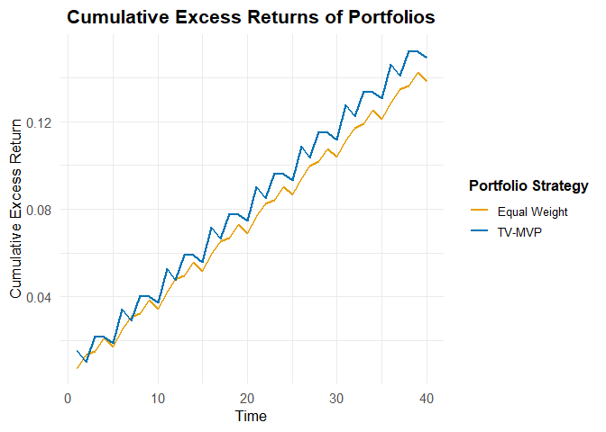

<!-- README.md is generated from README.Rmd. Please edit that file -->

# TVMVP (beta-version)

<!-- badges: start -->
<!-- badges: end -->

The TVMVP package implements a method of estimating a time dependent
covariance matrix based on time series data using principal component
analysis on kernel weighted data. The package also includes a hypothesis
test of time-invariant covariance, and methods for implementing the
time-dependent covariance matrix in a portfolio optimization setting.

This package is currently in development, and this version is a stable
beta-version.

## Installation

You can install the development version of TVMVP from
[GitHub](https://github.com/) with:

``` r
devtools::install_github("erilill/TV-MVP", ref = "beta")
```

provided that the package “devtools” (or “remotes”) has been installed
beforehand.

## Example

After installing the package, you attach the package by running the
code:

``` r
library(TVMVP)
```

For this example we will use simulated data, however most use cases for
this package will be using financial data. This can be accessed using
one of the many API’s available in R and elsewhere.

``` r
set.seed(123)
uT <- 100  # Number of time periods
up <- 20   # Number of assets
returns <- matrix(rnorm(uT * up, mean = 0.001, sd = 0.02), ncol = up)
```

We start by determining the number of factors and running the hypothesis
test:

``` r
m <- determine_factors(returns = returns, max_m = 10, bandwidth = silverman(returns))$optimal_m
m
#> [1] 1
hypothesis_test <- hyptest(returns = returns,
                            m = m,
                            B = 10, # Use larger B in practice
                            kernel_func = epanechnikov_kernel)
#> J_pT = 34.7556, p-value = 0.0000: Strong evidence that the covariance is time-varying.
```

The function `determine_factors` uses a BIC-type information criterion
in order to determine the optimal number of factors to be used in the
model. More information can be seen in section 2.2 of the thesis. The
input variables are the data matrix `returns`, the max number of factors
to be tested `max_m`, and the bandwidth to be used `bandwidth.` The
package offers the functionality of computing the bandwidth using
Silverman’s rule of thumb with the function `silverman()`, however other
methods could be used. The function outputs the optimal number of
factors `optimal_m`, and the values of the information criteria for the
different number of factors `IC_values`.

`hyptest1` implements the hypothesis test of constant factor loadings
introduced by Su & Wong (2017). Under some conditions, the test
statistic $J$ follows a standard normal distribution under the null.
However, the test have been proven to be somewhat unreliable in finite
sample usage, which is why the option of computing a bootstrap p-value
is included. More information can be found in section 2.3 in the thesis.
The function take the input: a data matrix of multiple time series
`returns`, the number of factors `m`, the number of bootstrap
replications `B`, and the kernel function `kernel_func`. The package
offers the Epanechnikov kernel, however others could also be used.

The next step, and the most relevant functionality is the portfolio
optimization. The package offers two functions for this purpose:
`expanding_tvmvp` which implements a expanding window in order to
evaluate the performance of a minimum variance portfolio implemented
using the time-varying covariance matrix, and `predict_portfolio` which
implements an out of sample prediction of the portfolio.

Note that these functions expect log returns and log risk free rate.

``` r
mvp_result <- expanding_tvmvp(
  returns        = returns,
  initial_window = 60,
  rebal_period   = 5,
  max_factors    = 10,
  return_type    = "daily",
  kernel_func    = epanechnikov_kernel,
  rf             = 1e-04
)
mvp_result
#> 
#> ── Rolling Window Portfolio Analysis ───────────────────────────────────────────
#> ────────────────────────────────────────────────────────────────────────────────
#> 
#> ── Summary Metrics ──
#> 
#>        Method     CER      MER       SD     SR MER_ann  SD_ann
#>         TVMVP 0.07378 0.001845 0.006332 0.2913  0.4648 0.10051
#>  Equal Weight 0.07347 0.001837 0.004648 0.3952  0.4628 0.07378
#> ────────────────────────────────────────────────────────────────────────────────
#> ── Detailed Components ──
#> 
#> The detailed portfolio outputs are stored in the following elements:
#> - Time-Varying MVP: Access via `$TVMVP`
#> - Equal Weight: Access via `$Equal`
plot(mvp_result)
```



The `expanding_tvmvp` function takes the input: `returns` a $T\times p$
data matrix, `initial_window` which is the initial holding window used
for estimation, `rebal_period` which is the length of the rebalancing
period to be used in the evaluation, `max_factors` used in the
determination of the optimal number of factors, `return_type` can be set
to “daily”, “weekly”, and “monthly”, and is used for annualization of
the results, `kernel_func`, and `rf` which denotes the risk free rate,
this can be input either as a scalar or at $(T-initialwindow)\times 1$
numerical vector. The function outputs relevant metrics for evaluation
of the performance of the portfolio such as cumulative excess returns,
standard deviation, and Sharpe ratio.

``` r
prediction <- predict_portfolio(returns = returns, 
                                horizon = 21, 
                                max_factors = 10,
                                kernel_func = epanechnikov_kernel,
                                min_return=0.5,
                                max_SR = TRUE,
                                rf = 1e-04)
prediction
#> 
#> ── Portfolio Optimization Predictions ──────────────────────────────────────────
#> ────────────────────────────────────────────────────────────────────────────────
#> 
#> ── Summary Metrics ──
#> 
#>                        Method expected_return    risk sharpe
#>    Minimum Variance Portfolio         0.03146 0.01843 0.3725
#>          Maximum SR Portfolio         0.06678 0.02685 0.5427
#>  Return-Constrained Portfolio         0.50000 0.25972 0.4201
#> ────────────────────────────────────────────────────────────────────────────────
#> ── Detailed Components ──
#> 
#> The detailed portfolio outputs are stored in the following elements:
#> - GMV: Use object$GMV
#> - Maximum Sharpe Ratio Portfolio: Use object$max_SR
#> - Minimum Variance Portfolio with Return Constraint: Use
#> object$MinVarWithReturnConstraint
```

The `predict_portfolio` functions makes out of sample predictions of the
portfolio performance. The functions offers three different methods of
portfolio optimization: Minimum variance, Minimum variance with minimum
returns constraint, and maximum Sharpe ratio portfolio. The minimum
variance portfolio is the default portfolio and will always be computed
when running this function. The minimum returns constraint is set by
imputing some `min_return`-value when running the function, important to
note is that the minimum return constraint is set for the entire horizon
and is not a daily constraint. The maximum SR portfolio is computed when
`max_SR` is set to `TRUE.`

If the pre-built functions does not fit your purpose, you can utilize
the covariance function by running:

``` r

cov_mat <- time_varying_cov(returns,
                            m,
                            bandwidth = silverman(returns),
                            kernel_func = epanechnikov_kernel,
                            M0 = 10,
                            rho_grid = seq(0.005, 2, length.out = 30),
                            floor_value = 1e-12,
                            epsilon2 = 1e-6,
                            full_output = FALSE)
```

Which outputs the covariance matrix weighted around the last observation
in returns.
